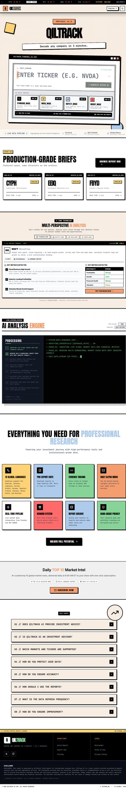
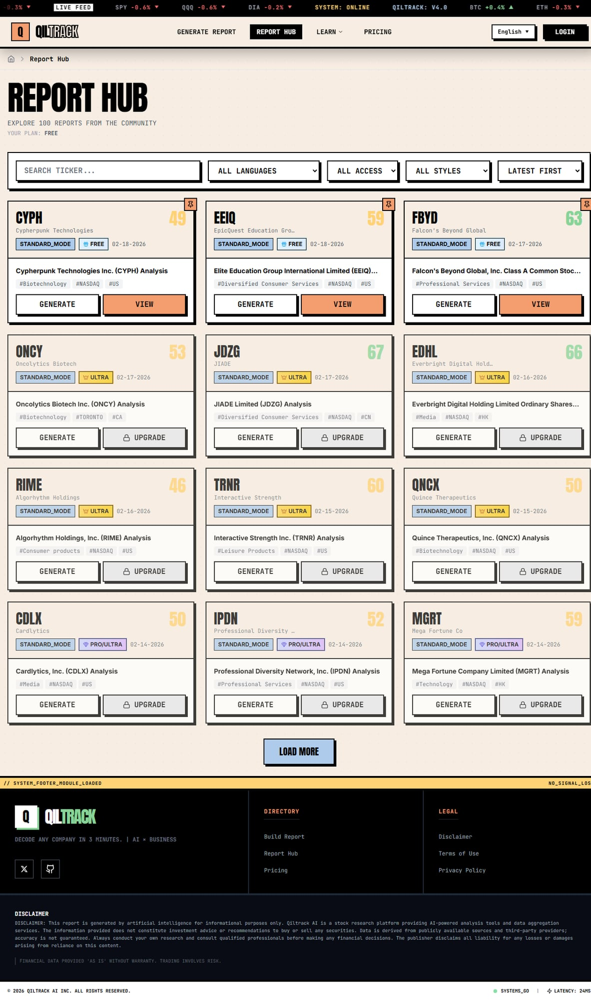
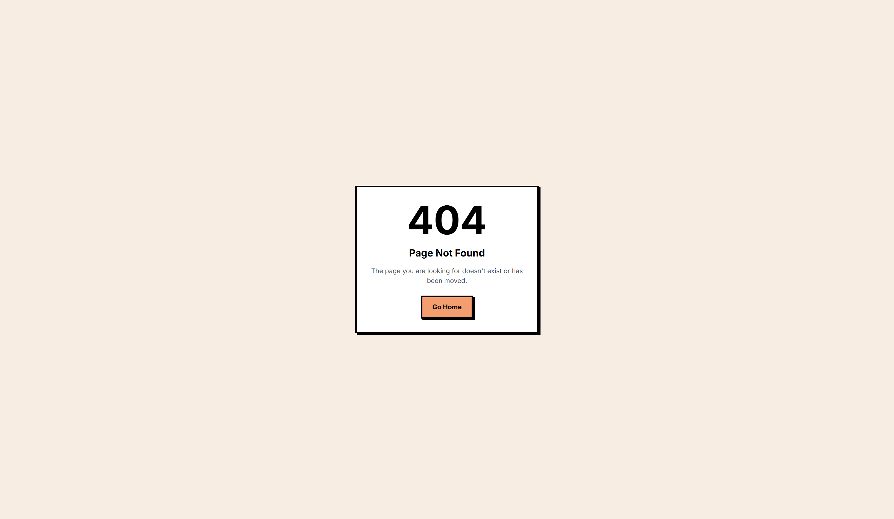

<div align="center">
  
  <h1>Qiltrack AI</h1>
  <p><strong>AI-Powered Equity Research for Individual Investors</strong></p>
  <p>Decode any company in 3 minutes — institutional-grade analysis, zero complexity.</p>

  <a href="https://qiltrack.com">🌐 Website</a> •
  <a href="https://qiltrack.com/en/hub">📊 Report Hub</a> •
  <a href="https://qiltrack.com/blog">📝 Blog</a> •
  <a href="https://x.com/wuji_labs">𝕏 Twitter</a>

  <br /><br />

  
  
  
  
</div>

---

## What is Qiltrack AI?

Qiltrack AI transforms complex financial data into clear, actionable research reports in **30 seconds**. We bring institutional-grade equity analysis to individual investors through multi-perspective AI — so you can make informed decisions without the Wall Street price tag.

<div align="center">
  
  <p><em>Terminal-style interface with real-time market data feed</em></p>
</div>

## ✨ Key Features

| Feature | Description |
|---------|-------------|
| **5 Research Personas** | Standard, Musk (growth), Buffett (value), Muddy Waters (short), and Deep-Dive |
| **30-Second Reports** | Comprehensive AI-generated analysis with evidence tracing |
| **13 Languages** | EN, 简体中文, 繁體中文, 日本語, 한국어, العربية, DE, ES, FR, IT, MS, NL, RU |
| **Global Markets** | US (NASDAQ/NYSE), Hong Kong, China A-shares, Taiwan |
| **Evidence Tracing** | Every claim linked to SEC filings (10-K, 10-Q) or verified news sources |
| **Pro Export Suite** | PDF, Word (DOCX), and clipboard export |
| **Daily Alpha Inbox** | Top 10 market movers delivered to your email daily |
| **Report Hub** | Browse 100+ community-generated reports for free |

## 📊 Report Hub

Explore AI-generated research reports from the community — filter by ticker, language, style, and access level.

<div align="center">
  
  <p><em>Browse, filter, and discover investment insights</em></p>
</div>

## 📄 AI-Generated Reports

Each report includes executive summary, financial analysis, competitive positioning, risk assessment, and actionable insights — all with source citations.

<div align="center">
  
  <p><em>Comprehensive equity research report with evidence tracing</em></p>
</div>

## 🚀 How It Works

```
┌─────────────────┐     ┌──────────────────┐     ┌─────────────────┐     ┌──────────────┐
│  Enter Ticker   │ ──▶ │  Select Persona  │ ──▶ │  AI Generates   │ ──▶ │   Export &    │
│  (e.g., NVDA)   │     │  (5 styles)      │     │  Report (~30s)  │     │   Share       │
└─────────────────┘     └──────────────────┘     └─────────────────┘     └──────────────┘
```

## 🛠 Tech Stack

- **Frontend**: Next.js 14, React, TypeScript, Tailwind CSS
- **AI Engine**: Multi-provider LLM orchestration for comprehensive analysis
- **Data Sources**: Real-time market data via Finnhub + SEC EDGAR filings
- **Infrastructure**: Vercel (Edge + Serverless), Supabase (Auth + DB)
- **Search**: Full-text search with multi-language support

## 🌍 Supported Languages

| Language | Code | Language | Code |
|----------|------|----------|------|
| English | `en` | Italiano | `it` |
| 简体中文 | `zh-CN` | Bahasa Melayu | `ms` |
| 繁體中文 | `zh-TW` | Nederlands | `nl` |
| 日本語 | `ja` | Русский | `ru` |
| 한국어 | `ko` | Deutsch | `de` |
| العربية | `ar` | Español | `es` |
| Français | `fr` | | |

## 📬 Daily Market Intel

Subscribe to receive daily Top 10 market movers analysis — AI-curated insights delivered to your inbox before market open.

→ [Subscribe at qiltrack.com](https://qiltrack.com/en#newsletter)

## 🔗 Links

- **Website**: [qiltrack.com](https://qiltrack.com)
- **Report Hub**: [qiltrack.com/hub](https://qiltrack.com/en/hub)
- **Blog**: [qiltrack.com/blog](https://qiltrack.com/blog)
- **Twitter**: [@wuji_labs](https://x.com/wuji_labs)
- **Contact**: [support@qiltrack.com](mailto:support@qiltrack.com)

## ⚖️ Disclaimer

Qiltrack AI is an educational and informational tool — **not a financial advisor**. We do not provide investment advice or recommendations to buy or sell any securities. Data is derived from publicly available sources; accuracy is not guaranteed. Always conduct your own research and consult qualified professionals before making financial decisions.

## 📄 License

[MIT](LICENSE)

---

<div align="center">
  <sub>Built with ❤️ by the <a href="https://github.com/wuji-labs">Qiltrack Team</a></sub>
</div>

## 联系 · Contact
扫码添加无极微信，交流合作 · Scan to add WUJI on WeChat

