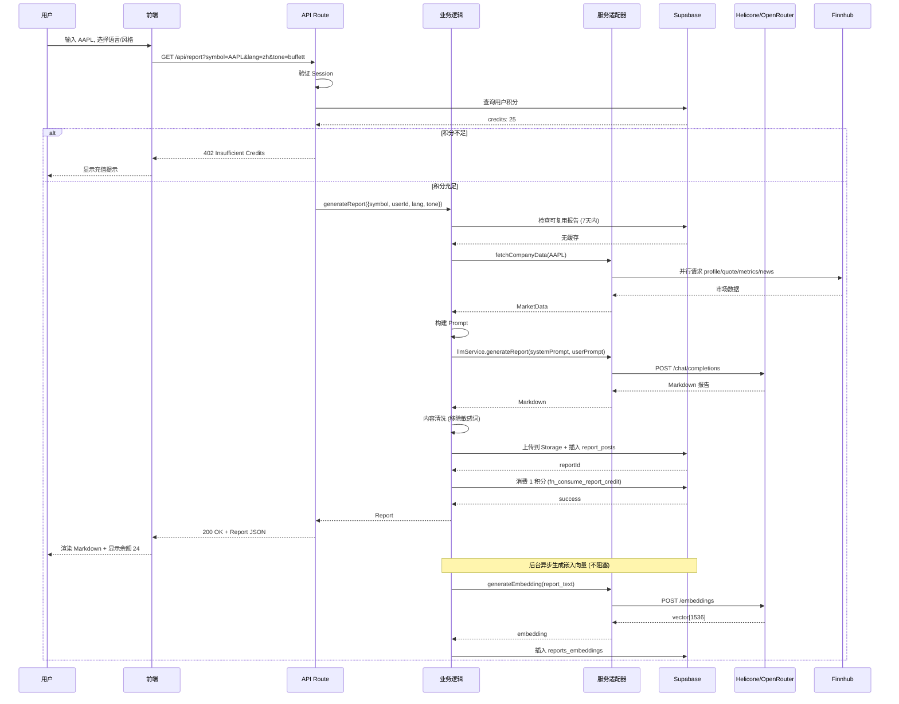

# Investor AI 架构文档

> **版本**: v1.0.0
> **更新日期**: 2025-12-02
> **状态**: Living Document (持续更新)

---

## 📋 目录

1. [架构概览](#架构概览)
2. [六层架构详解](#六层架构详解)
3. [数据流与调用链](#数据流与调用链)
4. [关键技术决策](#关键技术决策)
5. [安全架构](#安全架构)
6. [性能架构](#性能架构)
7. [可观测性架构](#可观测性架构)
8. [扩展性设计](#扩展性设计)
9. [架构演进计划](#架构演进计划)

---

## 架构概览

### 系统定位

Investor AI 是一个 **AI 驱动的投研报告生成平台**,为个人投资者提供"3分钟理解美股上市公司"的智能服务。

**核心能力**:

- 📊 实时市场数据聚合 (Finnhub API)
- 🤖 AI 报告生成 (OpenAI/Anthropic via Helicone/OpenRouter)
- 💳 积分系统与权限控制
- 📈 多语言、多风格报告输出
- 🔍 基于向量的相似报告推荐

### 技术栈总览

```
┌─────────────────────────────────────────────────────┐
│                    用户界面层                        │
│  Next.js 16 + React 19 + TailwindCSS 4             │
└─────────────────────────────────────────────────────┘
                        ↓
┌─────────────────────────────────────────────────────┐
│                   API 网关层                         │
│  Next.js API Routes + Edge Functions                │
└─────────────────────────────────────────────────────┘
                        ↓
┌─────────────────────────────────────────────────────┐
│                  业务逻辑层                          │
│  lib/core/* (Reports, Credits, Users)               │
└─────────────────────────────────────────────────────┘
                        ↓
┌─────────────────────────────────────────────────────┐
│                  服务适配层                          │
│  lib/services/* (LLM, MarketData, Storage)          │
└─────────────────────────────────────────────────────┘
                        ↓
┌─────────────────────────────────────────────────────┐
│                  基础设施层                          │
│  Supabase (PostgreSQL + Auth + Storage + RLS)      │
│  Helicone/OpenRouter (LLM)                          │
│  Finnhub (Market Data)                              │
│  Langfuse (Observability)                           │
└─────────────────────────────────────────────────────┘
```

---

## 六层架构详解

### Layer 1: 基础设施层 (Infrastructure)

#### 1.1 Supabase (核心数据平台)

**组件**:

- **PostgreSQL 15**: 关系型数据库
- **Auth**: 用户认证 (Email/OAuth)
- **Storage**: 对象存储 (报告文件)
- **RLS (Row Level Security)**: 行级安全策略
- **pgvector**: 向量嵌入存储

**核心表结构**:

```sql
-- 用户档案
profiles (
  id UUID PRIMARY KEY,
  email TEXT UNIQUE,
  display_name TEXT,
  plan TEXT (free/pro/enterprise),
  role TEXT (user/editor/admin),
  stripe_customer_id TEXT,
  created_at TIMESTAMPTZ
)

-- 积分系统
report_credits (
  user_id UUID PRIMARY KEY,
  credits_available INT DEFAULT 30,
  credits_used INT DEFAULT 0,
  last_reset TIMESTAMPTZ
)

-- 积分事件日志
report_credit_events (
  id UUID PRIMARY KEY,
  user_id UUID,
  event_type TEXT (consumed/granted/daily_reward),
  credits_amount INT,
  delta INT,
  reason TEXT,
  metadata JSONB,
  created_at TIMESTAMPTZ
)

-- 报告生成记录
report_runs (
  id UUID PRIMARY KEY,
  user_id UUID,
  symbol TEXT,
  tone TEXT (baseline/buffett/musk/muddy),
  language TEXT,
  status TEXT (processing/completed/failed),
  company_snapshot JSONB,
  markdown_path TEXT,
  duration_ms INT,
  error TEXT,
  created_at TIMESTAMPTZ
)

-- 报告发布
report_posts (
  id UUID PRIMARY KEY,
  title TEXT,
  slug TEXT UNIQUE,
  summary TEXT,
  body TEXT,
  cover TEXT,
  theme TEXT,
  tags TEXT[],
  lang TEXT,
  status TEXT (draft/published),
  author_id UUID,
  published_at TIMESTAMPTZ
)

-- 向量嵌入 (用于相似报告推荐)
reports_embeddings (
  id UUID PRIMARY KEY,
  report_run_id UUID,
  chunk_index INT,
  embedding vector(1536),
  lang TEXT,
  tone TEXT
)

-- 审计日志
audit_logs (
  id UUID PRIMARY KEY,
  user_id UUID,
  action TEXT,
  table_name TEXT,
  details JSONB,
  created_at TIMESTAMPTZ
)
```

**RLS 策略示例**:

```sql
-- 用户只能查看自己的积分
CREATE POLICY "Users can view own credits"
ON report_credits FOR SELECT
USING (auth.uid() = user_id);

-- 管理员可以查看所有报告
CREATE POLICY "Admins can view all reports"
ON report_runs FOR SELECT
USING (
  auth.uid() = user_id
  OR EXISTS (
    SELECT 1 FROM profiles
    WHERE profiles.id = auth.uid()
    AND profiles.role IN ('admin', 'superadmin')
  )
);
```

**RPC 函数**:

```sql
-- 消费积分 (原子操作)
fn_consume_report_credit(p_user_id UUID, p_symbol TEXT, p_metadata JSONB)
  RETURNS JSONB

-- 授予积分
fn_grant_credits(target_user_id UUID, amount INT, reason TEXT)
  RETURNS JSONB

-- 领取每日奖励
fn_claim_daily_reward(p_user_id UUID)
  RETURNS JSONB

-- 相似报告匹配 (向量搜索)
match_reports_embeddings(
  p_query_run_id UUID,
  p_lang TEXT,
  p_tone TEXT,
  match_threshold FLOAT DEFAULT 0.7,
  match_count INT DEFAULT 5
)
  RETURNS TABLE (report_run_id UUID, similarity FLOAT)
```

#### 1.2 外部服务

**Finnhub API** (市场数据)

- 公司概况 (profile)
- 实时报价 (quote)
- 财务指标 (metrics)
- 新闻动态 (news)

**Helicone** (LLM 网关,优先)

- OpenAI API 代理
- 请求缓存
- 可观测性

**OpenRouter** (LLM 备份)

- 多模型支持
- 自动故障转移

**Langfuse** (可观测性)

- LLM 调用追踪
- Token 使用统计
- 成本分析

---

### Layer 2: 服务适配层 (Service Adapters)

位置: `lib/services/`

#### 2.1 LLM 服务 (`lib/services/llm.ts`)

**职责**:

- 统一 LLM 调用接口
- 故障转移 (Helicone → OpenRouter)
- Embedding 生成

**接口**:

```typescript
interface LLMService {
  // 生成报告
  generateReport(
    systemPrompt: string,
    userPrompt: string,
    options?: {
      model?: string;
      temperature?: number;
      maxTokens?: number;
      trace?: LangfuseTrace;
    }
  ): Promise<string>;

  // 生成向量嵌入
  generateEmbedding(input: string): Promise<number[]>;
}
```

**实现逻辑**:

```typescript
export async function generateReport(...) {
  // 1. 优先使用 Helicone
  if (HELICONE_API_KEY) {
    try {
      return await callHelicone(...)
    } catch (error) {
      logger.warn('Helicone failed, falling back to OpenRouter')
    }
  }

  // 2. 故障转移到 OpenRouter
  if (OPENROUTER_API_KEY) {
    return await callOpenRouter(...)
  }

  throw new Error('No LLM provider available')
}
```

#### 2.2 市场数据服务 (`lib/services/market-data.ts`)

**职责**:

- 从 Finnhub 获取市场数据
- 并行请求优化
- 数据校验与转换

**接口**:

```typescript
interface MarketDataService {
  fetchCompanyData(symbol: string): Promise<MarketData>;
}

interface MarketData {
  profile: CompanyProfile; // 公司概况
  quote: Quote; // 实时报价
  metrics: Metrics; // 财务指标
  news: NewsItem[]; // 新闻动态 (最近60天,最多10条)
}
```

**实现逻辑**:

```typescript
export async function fetchCompanyData(symbol: string) {
  // 并行请求 (3-5秒)
  const [profile, quote, metrics, news] = await Promise.all([
    getProfile(symbol),
    getQuote(symbol),
    getMetrics(symbol),
    getNews(symbol, { from: "60daysAgo", limit: 10 }),
  ]);

  return { profile, quote, metrics, news };
}
```

#### 2.3 存储服务 (`lib/services/storage.ts`)

**职责**:

- Supabase Storage 封装
- 文件上传 (JSON/PDF/DOCX)
- 签名 URL 生成

**接口**:

```typescript
interface StorageService {
  uploadReport(
    userId: string,
    reportId: string,
    content: string,
    type: "json" | "pdf" | "docx"
  ): Promise<string>; // 返回文件路径

  getSignedUrl(path: string, expiresIn?: number): Promise<string>;
}
```

---

### Layer 3: 核心业务层 (Core Business Logic)

位置: `lib/core/`

#### 3.1 报告生成模块 (`lib/core/reports/`)

**generator.ts** - 报告生成器

```typescript
export async function generateReport(params: {
  symbol: string;
  userId: string;
  lang: string;
  tone: string;
  trace?: LangfuseTrace;
}): Promise<Report> {
  const { symbol, userId, lang, tone, trace } = params;

  // 1. 检查可复用报告 (7天内相同参数)
  const cached = await checkReusableReport(symbol, lang, tone);
  if (cached) return cached;

  // 2. 获取市场数据 (3-5秒)
  const marketData = await fetchCompanyData(symbol);

  // 3. 构建 Prompt
  const { systemPrompt, userPrompt } = buildPrompts(marketData, lang, tone);

  // 4. LLM 生成 (10-30秒)
  const markdown = await llmService.generateReport(systemPrompt, userPrompt, { trace });

  // 5. 内容清洗
  const sanitized = await sanitizeContent(markdown);

  // 6. 持久化
  const report = await saveReport({
    userId,
    symbol,
    lang,
    tone,
    markdown: sanitized,
    companySnapshot: marketData,
  });

  // 7. 后台生成嵌入 (不阻塞)
  generateEmbeddingsAsync(report.id, sanitized);

  return report;
}
```

**persistence.ts** - 持久化层

```typescript
export async function saveReport(data: SaveReportInput) {
  const supabase = createServerClient();

  // 1. 上传 JSON 到 Storage
  const jsonPath = await storageService.uploadReport(
    data.userId,
    data.reportId,
    JSON.stringify(data),
    "json"
  );

  // 2. 插入 report_posts 表
  const { data: post } = await supabase
    .from("report_posts")
    .insert({
      title: `${data.symbol} 投资分析报告`,
      slug: `${data.symbol}-${Date.now()}`,
      body: data.markdown,
      lang: data.lang,
      tags: [data.symbol, data.tone],
      author_id: data.userId,
      status: "published",
    })
    .select()
    .single();

  // 3. 记录 audit_logs
  await recordAudit({
    userId: data.userId,
    action: "report_generated",
    table_name: "report_posts",
    details: { symbol: data.symbol, postId: post.id },
  });

  return post;
}
```

**embeddings.ts** - 向量嵌入

```typescript
export async function generateEmbeddingsAsync(reportId: string, content: string) {
  // 1. 分块 (3500 字符/块, 400 字符重叠)
  const chunks = chunkReport(content, {
    chunkSize: 3500,
    overlap: 400,
  });

  // 2. 批量生成 embedding
  const embeddings = await Promise.all(
    chunks.map(async (chunk, index) => {
      const vector = await llmService.generateEmbedding(chunk);
      return {
        report_run_id: reportId,
        chunk_index: index,
        embedding: vector,
      };
    })
  );

  // 3. 批量插入
  const supabase = createServerClient();
  await supabase.from("reports_embeddings").insert(embeddings);
}
```

**content-sanitizer.ts** - 内容清洗

```typescript
export function sanitizeContent(markdown: string): string {
  // 1. 移除敏感词汇 (买入/卖出/调仓)
  const sensitiveWords = ["买入", "卖出", "强烈推荐", "立即购买"];
  let sanitized = markdown;

  for (const word of sensitiveWords) {
    sanitized = sanitized.replace(new RegExp(word, "gi"), "[请自行判断]");
  }

  // 2. 规范化语言标识
  sanitized = normalizeLanguage(sanitized);

  // 3. 验证 Markdown 格式
  if (!isValidMarkdown(sanitized)) {
    throw new ValidationError("Invalid Markdown format");
  }

  return sanitized;
}
```

#### 3.2 积分管理模块 (`lib/core/credits/`)

**manager.ts** - 积分管理器

```typescript
export class CreditManager {
  // 检查并消费积分 (原子操作)
  async checkAndConsume(
    userId: string,
    symbol: string,
    metadata?: Record<string, any>
  ): Promise<void> {
    const supabase = createServerClient();

    const { data, error } = await supabase.rpc("fn_consume_report_credit", {
      p_user_id: userId,
      p_symbol: symbol,
      p_metadata: metadata,
    });

    if (error || !data.success) {
      throw new InsufficientCreditsError(`积分不足。当前余额: ${data.remaining_credits}`);
    }
  }

  // 获取积分余额
  async getBalance(userId: string): Promise<number> {
    const supabase = createServerClient();

    const { data } = await supabase
      .from("report_credits")
      .select("credits_available")
      .eq("user_id", userId)
      .single();

    return data?.credits_available ?? 0;
  }

  // 授予积分 (管理员)
  async grantCredits(
    targetUserId: string,
    amount: number,
    reason: string,
    adminUserId: string
  ): Promise<void> {
    const supabase = createServerClient();

    await supabase.rpc("fn_grant_credits", {
      target_user_id: targetUserId,
      amount,
      reason: `${reason} (by admin ${adminUserId})`,
    });
  }

  // 领取每日奖励
  async claimDailyReward(userId: string): Promise<number> {
    const supabase = createServerClient();

    const { data } = await supabase.rpc("fn_claim_daily_reward", {
      p_user_id: userId,
    });

    if (!data.success) {
      throw new Error(data.message);
    }

    return data.credits_granted;
  }

  // 获取积分历史
  async getTransactionHistory(userId: string, limit = 50): Promise<CreditEvent[]> {
    const supabase = createServerClient();

    const { data } = await supabase
      .from("report_credit_events")
      .select("*")
      .eq("user_id", userId)
      .order("created_at", { ascending: false })
      .limit(limit);

    return data ?? [];
  }
}
```

#### 3.3 错误处理 (`lib/core/errors.ts`)

```typescript
// 基础错误类
export class AppError extends Error {
  constructor(
    message: string,
    public code: string,
    public statusCode: number = 500,
    public details?: Record<string, any>
  ) {
    super(message);
    this.name = this.constructor.name;
  }
}

// 具体错误类型
export class InsufficientCreditsError extends AppError {
  constructor(message: string) {
    super(message, "INSUFFICIENT_CREDITS", 402);
  }
}

export class ReportGenerationError extends AppError {
  constructor(message: string, details?: Record<string, any>) {
    super(message, "REPORT_GENERATION_FAILED", 500, details);
  }
}

export class UnauthorizedError extends AppError {
  constructor(message = "Unauthorized") {
    super(message, "UNAUTHORIZED", 401);
  }
}

export class ValidationError extends AppError {
  constructor(message: string, details?: Record<string, any>) {
    super(message, "VALIDATION_ERROR", 400, details);
  }
}

export class ExternalServiceError extends AppError {
  constructor(service: string, message: string, details?: Record<string, any>) {
    super(`${service}: ${message}`, "EXTERNAL_SERVICE_ERROR", 502, details);
  }
}
```

---

### Layer 4: API 网关层 (API Routes)

位置: `app/api/`

#### 4.1 核心 API 路由

**报告生成** - `app/api/report/route.ts`

```typescript
export async function GET(request: Request) {
  try {
    // 1. 认证
    const user = await getCurrentUser();
    if (!user) throw new UnauthorizedError();

    // 2. 参数校验
    const { symbol, lang, tone } = validateReportParams(request.url);

    // 3. 检查积分并消费
    await creditManager.checkAndConsume(user.id, symbol);

    // 4. 生成报告
    const report = await generateReport({
      symbol,
      userId: user.id,
      lang,
      tone,
    });

    // 5. 返回结果
    return successResponse(report);
  } catch (error) {
    return handleApiError(error);
  }
}
```

**积分查询** - `app/api/report/credits/route.ts`

```typescript
export async function GET() {
  try {
    const user = await getCurrentUser();
    if (!user) throw new UnauthorizedError();

    const balance = await creditManager.getBalance(user.id);

    return successResponse({
      userId: user.id,
      credits: balance,
    });
  } catch (error) {
    return handleApiError(error);
  }
}
```

**历史报告** - `app/api/report/history/route.ts`

```typescript
export async function GET(request: Request) {
  try {
    const user = await getCurrentUser();
    if (!user) throw new UnauthorizedError();

    const { page = 1, limit = 20 } = parseQueryParams(request.url);

    const supabase = createServerClient();
    const { data, count } = await supabase
      .from("report_posts")
      .select("*", { count: "exact" })
      .eq("author_id", user.id)
      .order("created_at", { ascending: false })
      .range((page - 1) * limit, page * limit - 1);

    return successResponse({
      reports: data,
      pagination: {
        page,
        limit,
        total: count,
      },
    });
  } catch (error) {
    return handleApiError(error);
  }
}
```

**相似报告推荐** - `app/api/report/similar/route.ts`

```typescript
export async function GET(request: Request) {
  try {
    const user = await getCurrentUser();
    if (!user) throw new UnauthorizedError();

    const { reportId, lang, tone } = parseQueryParams(request.url);

    const supabase = createServerClient();
    const { data } = await supabase.rpc("match_reports_embeddings", {
      p_query_run_id: reportId,
      p_lang: lang,
      p_tone: tone,
      match_threshold: 0.7,
      match_count: 5,
    });

    return successResponse({ similar: data });
  } catch (error) {
    return handleApiError(error);
  }
}
```

#### 4.2 管理后台 API

**用户管理** - `app/api/admin/users/`

```typescript
// 创建用户
POST / api / admin / users / create;
// 更新用户
PATCH / api / admin / users / update;
// 删除用户
DELETE /
  api /
  admin /
  users /
  delete (
    // 重置密码
    POST
  ) /
  api /
  admin /
  users /
  reset -
  password;
```

**报告管理** - `app/api/admin/runs/`

```typescript
// 查询所有报告生成记录
GET / api / admin / runs;
// 标记为特色报告
POST / api / admin / runs / [id] / feature;
// 取消特色
POST / api / admin / runs / [id] / unfeature;
```

#### 4.3 API 错误处理中间件

**lib/api/error-handler.ts**

```typescript
export function handleApiError(error: unknown): NextResponse {
  // 1. AppError 类型错误
  if (error instanceof AppError) {
    return NextResponse.json(
      {
        success: false,
        error: {
          code: error.code,
          message: error.message,
          details: error.details,
        },
      },
      { status: error.statusCode }
    );
  }

  // 2. Supabase 错误
  if (isSupabaseError(error)) {
    return NextResponse.json(
      {
        success: false,
        error: {
          code: "DATABASE_ERROR",
          message: error.message,
        },
      },
      { status: 500 }
    );
  }

  // 3. 未知错误
  logger.error("Unhandled error", error);
  return NextResponse.json(
    {
      success: false,
      error: {
        code: "INTERNAL_SERVER_ERROR",
        message: "An unexpected error occurred",
      },
    },
    { status: 500 }
  );
}

export function successResponse<T>(data: T, status = 200): NextResponse {
  return NextResponse.json(
    {
      success: true,
      data,
    },
    { status }
  );
}
```

---

### Layer 5: 前端层 (Frontend)

#### 5.1 页面结构

```
app/
├── page.tsx                    # 首页
├── layout.tsx                  # 全局布局
├── (auth)/
│   └── login/page.tsx          # 登录页
├── account/
│   ├── page.tsx                # 用户中心
│   ├── history/page.tsx        # 历史报告
│   └── change-password/page.tsx
├── reports/
│   ├── page.tsx                # 报告列表
│   └── [slug]/page.tsx         # 报告详情
└── admin/
    ├── layout.tsx              # 管理后台布局 (Refine)
    ├── page.tsx                # 仪表盘
    ├── users/page.tsx          # 用户管理
    ├── credits/page.tsx        # 积分管理
    └── runs/page.tsx           # 生成记录
```

#### 5.2 核心组件

```
app/sections/
├── HeroSection.tsx             # 首页 Hero
├── ReportGeneratorSection.tsx  # 报告生成器 (待拆分)
├── ModesSection.tsx            # 报告风格展示
├── WhySection.tsx              # 产品优势
└── FooterSection.tsx           # 页脚

app/components/
├── ProgressBar.tsx             # 进度条
├── KpiCard.tsx                 # KPI 卡片
└── ReportCharts.tsx            # 图表渲染
```

#### 5.3 状态管理 (当前)

**现状**:

- ❌ 无全局状态管理
- ✅ 使用 React 19 `useState`/`useEffect`
- ⚠️ 用户信息、积分余额在多处重复查询

**待改进** (Phase 2):

- ✅ 引入 Zustand
- ✅ 全局状态: `user`, `credits`, `theme`
- ✅ React Query 数据缓存

---

### Layer 6: 管理后台 (Admin Panel)

#### 6.1 Refine.dev 集成

**lib/admin/data-provider.ts**

```typescript
export const supabaseDataProvider: DataProvider = {
  getList: async (resource, params) => {
    const supabase = createServerClient()
    const { page, perPage, filters, sorters } = params.pagination

    let query = supabase.from(resource).select('*', { count: 'exact' })

    // 应用过滤
    filters?.forEach(filter => {
      query = applyFilter(query, filter)
    })

    // 应用排序
    sorters?.forEach(sorter => {
      query = query.order(sorter.field, {
        ascending: sorter.order === 'asc'
      })
    })

    // 分页
    const { data, count } = await query.range(
      (page - 1) * perPage,
      page * perPage - 1
    )

    return { data, total: count }
  },

  getOne: async (resource, params) => { ... },
  create: async (resource, params) => { ... },
  update: async (resource, params) => { ... },
  delete: async (resource, params) => { ... },

  // 自定义方法
  custom: async ({ url, method, payload }) => {
    if (url === 'batch-grant-credits') {
      return await batchGrantCredits(payload)
    }
  }
}
```

**lib/admin/auth-provider.ts**

```typescript
export const authProvider: AuthProvider = {
  login: async ({ email, password }) => {
    const supabase = createServerClient();
    const { error } = await supabase.auth.signInWithPassword({
      email,
      password,
    });
    if (error) throw error;
  },

  logout: async () => {
    const supabase = createServerClient();
    await supabase.auth.signOut();
  },

  check: async () => {
    const supabase = createServerClient();
    const {
      data: { user },
    } = await supabase.auth.getUser();

    if (!user) throw new Error("Not authenticated");

    // 检查管理员权限
    const { data: profile } = await supabase
      .from("profiles")
      .select("role")
      .eq("id", user.id)
      .single();

    if (!["admin", "superadmin"].includes(profile.role)) {
      throw new Error("Not authorized");
    }
  },

  getPermissions: async () => {
    const user = await getCurrentUser();
    return user.role;
  },

  getIdentity: async () => {
    const user = await getCurrentUser();
    return {
      id: user.id,
      name: user.display_name,
      avatar: user.avatar_url,
    };
  },
};
```

---

## 数据流与调用链

### 完整报告生成流程



### 性能指标

| 步骤                | 时间       | 说明                  |
| ------------------- | ---------- | --------------------- |
| 认证 + 积分校验     | 100-200ms  | Supabase RPC          |
| 市场数据获取        | 3-5s       | Finnhub 并行请求      |
| LLM 生成            | 10-30s     | 取决于模型和 token 数 |
| 内容清洗 + 持久化   | 500ms-1s   | 正则替换 + DB 写入    |
| 嵌入生成 (异步)     | 5-10s      | 不阻塞主流程          |
| **总计 (用户感知)** | **15-40s** | -                     |

---

## 关键技术决策

### 决策 1: 为什么选择 Supabase?

**理由**:

- ✅ PostgreSQL + Auth + Storage + RLS 一体化
- ✅ RLS 策略实现细粒度权限控制
- ✅ pgvector 原生支持向量嵌入
- ✅ 实时订阅 (未来可用于实时通知)
- ✅ 开源,可自托管

**替代方案**:

- Firebase: 不支持关系型查询
- PlanetScale: 缺少 Auth 和 Storage
- 自建 PostgreSQL: 运维成本高

### 决策 2: 为什么使用 Helicone + OpenRouter 双提供商?

**理由**:

- ✅ **弹性**: Helicone 宕机时自动切换 OpenRouter
- ✅ **可观测性**: Helicone 提供缓存和追踪
- ✅ **成本优化**: 相同请求缓存,节省 token
- ✅ **模型灵活性**: OpenRouter 支持多种模型

**风险**:

- ⚠️ 双依赖增加复杂度
- ⚠️ 需要同步配置两套 API Key

### 决策 3: 为什么不使用 Prisma?

**现状**: 项目中安装了 `@prisma/client`,但实际使用 Supabase Client

**理由**:

- ✅ Supabase Client 直接支持 RLS
- ✅ 不需要额外的 ORM 层
- ✅ 减少依赖和构建时间

**待清理**: 移除 `prisma` 依赖 (遗留代码)

### 决策 4: 为什么积分消费使用 RPC 而非 REST API?

**理由**:

- ✅ **原子性**: 数据库级事务保证
- ✅ **性能**: 单次数据库调用,减少网络往返
- ✅ **安全**: 逻辑在数据库层,不可被客户端绕过

**示例**:

```sql
CREATE OR REPLACE FUNCTION fn_consume_report_credit(
  p_user_id UUID,
  p_symbol TEXT,
  p_metadata JSONB DEFAULT '{}'::jsonb
) RETURNS JSONB AS $$
DECLARE
  v_available INT;
BEGIN
  -- 1. 锁定行
  SELECT credits_available INTO v_available
  FROM report_credits
  WHERE user_id = p_user_id
  FOR UPDATE;

  -- 2. 检查余额
  IF v_available < 1 THEN
    RETURN jsonb_build_object(
      'success', false,
      'message', '积分不足',
      'remaining_credits', v_available
    );
  END IF;

  -- 3. 扣减积分 (原子操作)
  UPDATE report_credits
  SET
    credits_available = credits_available - 1,
    credits_used = credits_used + 1
  WHERE user_id = p_user_id;

  -- 4. 记录事件
  INSERT INTO report_credit_events (user_id, event_type, credits_amount, delta, metadata)
  VALUES (p_user_id, 'consumed', 1, -1, p_metadata);

  -- 5. 返回成功
  RETURN jsonb_build_object(
    'success', true,
    'remaining_credits', v_available - 1
  );
END;
$$ LANGUAGE plpgsql;
```

### 决策 5: 为什么报告嵌入生成是异步的?

**理由**:

- ✅ **用户体验**: 不阻塞报告返回 (15-40s → 15-40s,而非 +10s)
- ✅ **解耦**: 嵌入失败不影响报告生成
- ✅ **成本**: 可以批量处理,降低 LLM 调用成本

**实现**:

- 当前: `generateEmbeddingsAsync()` 直接调用 (await 但不返回)
- 未来 (Phase 2): 使用 BullMQ 队列,由 Worker 处理

---

## 安全架构

### 1. 认证与授权

#### 1.1 认证流程

```
用户 → Supabase Auth → JWT Token → Cookie (httpOnly, secure)
                                    ↓
                            API Route 验证 JWT
                                    ↓
                            提取 user_id
                                    ↓
                            RLS 策略自动应用
```

#### 1.2 角色权限

| 角色           | 权限                                           |
| -------------- | ---------------------------------------------- |
| **user**       | 生成报告、查看自己的数据、修改个人资料         |
| **editor**     | user 权限 + 发布报告、审核用户上传             |
| **admin**      | editor 权限 + 用户管理、积分管理、查看所有数据 |
| **superadmin** | admin 权限 + 删除用户、修改系统配置            |

#### 1.3 RLS 策略示例

```sql
-- profiles 表: 用户只能查看/更新自己的资料
CREATE POLICY "Users can view own profile"
ON profiles FOR SELECT
USING (auth.uid() = id);

CREATE POLICY "Users can update own profile"
ON profiles FOR UPDATE
USING (auth.uid() = id);

-- admin 可以查看所有用户
CREATE POLICY "Admins can view all profiles"
ON profiles FOR SELECT
USING (
  EXISTS (
    SELECT 1 FROM profiles
    WHERE id = auth.uid()
    AND role IN ('admin', 'superadmin')
  )
);

-- report_posts 表: 已发布的报告公开可读
CREATE POLICY "Published reports are publicly readable"
ON report_posts FOR SELECT
USING (status = 'published');

-- 用户可以查看自己的草稿
CREATE POLICY "Users can view own drafts"
ON report_posts FOR SELECT
USING (author_id = auth.uid());
```

### 2. 数据安全

#### 2.1 敏感数据加密

| 数据类型           | 加密方式                     |
| ------------------ | ---------------------------- |
| 密码               | Supabase Auth (bcrypt)       |
| Stripe Customer ID | 明文 (但不暴露给客户端)      |
| API Keys           | 环境变量 (不入库)            |
| JWT Token          | httpOnly Cookie, secure flag |

#### 2.2 防 SQL 注入

- ✅ 使用 Supabase Client (参数化查询)
- ✅ RPC 函数参数类型检查
- ❌ 避免直接拼接 SQL

#### 2.3 防 XSS

- ✅ React 自动转义
- ✅ Markdown 渲染使用 `react-markdown` (内置 sanitize)
- ⚠️ 用户上传内容需额外校验

### 3. API 安全

#### 3.1 限流 (待实现 - Phase 1)

```typescript
// 每用户每分钟最多 5 次报告生成请求
const ratelimit = new Ratelimit({
  redis: Redis.fromEnv(),
  limiter: Ratelimit.slidingWindow(5, "1 m"),
});

// 全局请求限流: 每 IP 每秒 20 次
const globalRateLimit = new Ratelimit({
  redis: Redis.fromEnv(),
  limiter: Ratelimit.slidingWindow(20, "1 s"),
});
```

#### 3.2 CORS

```typescript
// next.config.ts
export default {
  async headers() {
    return [
      {
        source: "/api/:path*",
        headers: [
          { key: "Access-Control-Allow-Origin", value: process.env.NEXTAUTH_URL },
          { key: "Access-Control-Allow-Methods", value: "GET,POST,PUT,DELETE" },
          { key: "Access-Control-Allow-Credentials", value: "true" },
        ],
      },
    ];
  },
};
```

#### 3.3 CSRF 保护

- ✅ NextAuth 内置 CSRF Token
- ✅ SameSite=Lax Cookie 策略

---

## 性能架构

### 当前性能指标

| 指标                    | 当前值 | 目标值 (Phase 2) |
| ----------------------- | ------ | ---------------- |
| 报告生成 P95            | ~30s   | <15s             |
| 首页 FCP                | ~1.5s  | <1.2s            |
| 首页 LCP                | ~3.0s  | <2.5s            |
| API 响应时间 (积分查询) | ~200ms | <100ms           |
| 缓存命中率              | 0%     | >50%             |

### 性能优化策略

#### 1. 缓存层 (Phase 2)

```typescript
// lib/cache/redis.ts
import { Redis } from "@upstash/redis";

const redis = Redis.fromEnv();

// 市场数据缓存 (1小时)
export async function getCachedMarketData(symbol: string) {
  const key = `market:${symbol}`;
  const cached = await redis.get(key);

  if (cached) return JSON.parse(cached);

  const data = await fetchCompanyData(symbol);
  await redis.setex(key, 3600, JSON.stringify(data));

  return data;
}

// 报告复用缓存 (7天)
export async function getCachedReport(params: { symbol: string; lang: string; tone: string }) {
  const key = `report:${params.symbol}:${params.lang}:${params.tone}`;
  const cached = await redis.get(key);

  if (cached) {
    const report = JSON.parse(cached);
    if (Date.now() - report.createdAt < 7 * 24 * 3600 * 1000) {
      return report;
    }
  }

  return null;
}
```

#### 2. 数据库查询优化

**索引策略**:

```sql
-- 高频查询字段建索引
CREATE INDEX idx_report_posts_author_created
ON report_posts(author_id, created_at DESC);

CREATE INDEX idx_report_posts_slug
ON report_posts(slug) WHERE status = 'published';

CREATE INDEX idx_report_credits_user
ON report_credits(user_id);

CREATE INDEX idx_report_credit_events_user_created
ON report_credit_events(user_id, created_at DESC);

-- 向量索引 (IVFFlat)
CREATE INDEX idx_reports_embeddings_vector
ON reports_embeddings USING ivfflat (embedding vector_cosine_ops)
WITH (lists = 100);
```

#### 3. 前端优化

**代码分割**:

```typescript
// app/page.tsx
import dynamic from 'next/dynamic'

const ReportGeneratorSection = dynamic(
  () => import('./sections/ReportGeneratorSection'),
  { ssr: false, loading: () => <LoadingSkeleton /> }
)
```

**图片优化**:

```typescript
import Image from 'next/image'

<Image
  src="/hero-bg.png"
  alt="Hero Background"
  width={1920}
  height={1080}
  priority
  placeholder="blur"
/>
```

**字体优化**:

```typescript
// app/layout.tsx
import { Inter } from "next/font/google";

const inter = Inter({
  subsets: ["latin"],
  display: "swap",
  preload: true,
});
```

---

## 可观测性架构

### 当前状态

| 组件        | 状态      | 覆盖范围     |
| ----------- | --------- | ------------ |
| Langfuse    | ✅ 已集成 | LLM 调用追踪 |
| Sentry      | ❌ 未集成 | -            |
| 结构化日志  | ❌ 未实现 | -            |
| APM         | ❌ 未实现 | -            |
| Uptime 监控 | ❌ 未实现 | -            |

### 目标架构 (Phase 3)

```
┌─────────────────────────────────────────────────┐
│                  应用层                          │
│  Next.js + Sentry (错误追踪)                    │
└─────────────────────────────────────────────────┘
                    ↓ (errors, traces)
┌─────────────────────────────────────────────────┐
│                 日志收集层                       │
│  Pino (JSON logs) → Vercel Logs → Axiom/Logtail│
└─────────────────────────────────────────────────┘
                    ↓
┌─────────────────────────────────────────────────┐
│                 可视化层                         │
│  ├─ Sentry Dashboard (错误分析)                │
│  ├─ Langfuse Dashboard (LLM 追踪)              │
│  ├─ Vercel Analytics (性能指标)                │
│  └─ 自建仪表盘 (业务指标)                       │
└─────────────────────────────────────────────────┘
                    ↓
┌─────────────────────────────────────────────────┐
│                 告警层                           │
│  Slack/Email (>10 errors/hour, 5xx >5%)        │
└─────────────────────────────────────────────────┘
```

### 日志规范

```typescript
// lib/logger.ts
import pino from "pino";

const logger = pino({
  level: process.env.LOG_LEVEL || "info",
  formatters: {
    level: (label) => ({ level: label }),
  },
});

// 使用示例
logger.info(
  {
    userId: "user-123",
    symbol: "AAPL",
    duration: 15230,
  },
  "Report generated successfully"
);

logger.error(
  {
    userId: "user-123",
    error: error.message,
    stack: error.stack,
  },
  "Report generation failed"
);
```

### 追踪示例

```typescript
// lib/observability/langfuse.ts
import { Langfuse } from 'langfuse'

const langfuse = new Langfuse({
  publicKey: process.env.LANGFUSE_PUBLIC_KEY,
  secretKey: process.env.LANGFUSE_SECRET_KEY
})

export function createTrace(name: string, userId: string) {
  return langfuse.trace({
    name,
    userId,
    metadata: {
      environment: process.env.NODE_ENV
    }
  })
}

// 使用
const trace = createTrace('report-generation', userId)
const span = trace.span({ name: 'llm-call' })

const result = await llmService.generateReport(...)

span.end({
  output: result,
  metadata: { model: 'gpt-4o-mini', tokens: 1500 }
})

trace.update({ output: report })
```

---

## 扩展性设计

### 当前架构的扩展瓶颈

| 瓶颈            | 当前限制        | 目标容量    |
| --------------- | --------------- | ----------- |
| Serverless 超时 | 10分钟 (Vercel) | 支持长任务  |
| 并发限制        | ~100 req/s      | >1000 req/s |
| LLM 调用同步    | 阻塞 API 响应   | 异步队列    |
| 单一数据库      | Supabase 单实例 | 读写分离    |

### 演进路径

#### Stage 1: 当前 (MVP)

```
Vercel (Serverless)
    ↓
Supabase (All-in-one)
    ↓
Helicone/OpenRouter (LLM)
Finnhub (Market Data)
```

**适用场景**: <1000 用户, <100 报告/天

#### Stage 2: 引入队列 (Phase 2)

```
Vercel (API Gateway)
    ↓
Upstash Redis (Cache + Queue)
    ↓
BullMQ Worker (报告生成)
    ↓
Supabase (主数据库)
    ↓
LLM / Market Data
```

**适用场景**: <10K 用户, <1000 报告/天

#### Stage 3: 微服务化 (6个月后)

```
Cloudflare CDN
    ↓
API Gateway (Kong/Tyk)
    ├─ User Service (认证/用户管理)
    ├─ Report Service (报告生成)
    ├─ Credit Service (积分管理)
    └─ Search Service (向量搜索)
    ↓
PostgreSQL (主库) + Read Replicas
Redis Cluster (缓存)
RabbitMQ (消息队列)
    ↓
Object Storage (S3/R2)
Elasticsearch (日志/搜索)
```

**适用场景**: >100K 用户, >10K 报告/天

---

## 架构演进计划

### Phase 1: 地基加固 (Week 1-2)

**目标**: 消除技术债,提升代码质量

- [x] 数据库类型同步
- [x] API 限流
- [x] 组件拆分 (ReportGeneratorSection)
- [x] 全局错误边界
- [x] 代码格式化 (Prettier)

### Phase 2: 缓存与队列 (Week 3-4)

**目标**: 性能提升 2x,支持 10x 并发

- [ ] Upstash Redis 缓存
- [ ] BullMQ 消息队列
- [ ] 异步报告生成
- [ ] 重试与熔断机制

### Phase 3: 可观测性 (Week 5-6)

**目标**: 5 分钟定位任何问题

- [ ] Sentry 错误追踪
- [ ] Pino 结构化日志
- [ ] 业务指标仪表盘
- [ ] Uptime 监控

### Phase 4: 自动化 (Week 7-8)

**目标**: 测试覆盖 >70%,自动化部署

- [ ] GitHub Actions CI/CD
- [ ] 服务层单元测试
- [ ] E2E 测试 (Playwright)
- [ ] 金丝雀部署

### Phase 5: 支付闭环 (Week 9-10)

**目标**: 完整的付费订阅流程

- [ ] Stripe Checkout 集成
- [ ] Webhook 处理
- [ ] 订阅管理 UI
- [ ] 发票生成

---

## 附录

### A. 环境变量清单

```bash
# Supabase
NEXT_PUBLIC_SUPABASE_URL=
NEXT_PUBLIC_SUPABASE_ANON_KEY=
SUPABASE_SERVICE_ROLE_KEY=
SUPABASE_STORAGE_REPORT_BUCKET=report-assets

# LLM (至少配置其一)
HELICONE_API_KEY=
HELICONE_MODEL=gpt-4o-mini
OPENROUTER_API_KEY=
OPENROUTER_MODEL=anthropic/claude-3.5-sonnet

# Market Data
FINNHUB_API_KEY=

# Auth
NEXTAUTH_URL=http://localhost:3000
NEXTAUTH_SECRET=

# Observability (可选)
LANGFUSE_PUBLIC_KEY=
LANGFUSE_SECRET_KEY=
SENTRY_DSN=

# Cache & Queue (Phase 2)
UPSTASH_REDIS_REST_URL=
UPSTASH_REDIS_REST_TOKEN=

# Payment (Phase 5)
STRIPE_SECRET_KEY=
STRIPE_WEBHOOK_SECRET=
```

### B. 数据库迁移列表

| 文件名                                                       | 描述             |
| ------------------------------------------------------------ | ---------------- |
| `20251123000001_init_schema.sql`                             | 初始化基础表结构 |
| `20251124000002_align_hosted_schema.sql`                     | 对齐托管环境     |
| `20251128000003_sync_quota_schema.sql`                       | 同步 quota 架构  |
| `20251128000004_report_assets_rls.sql`                       | 报告资产 RLS     |
| `20251129000005_report_embeddings_and_template_nullable.sql` | 添加嵌入向量     |
| `20251129000005_report_posts_and_uploads.sql`                | 报告发布功能     |
| `20251130000001_init_user_credits_30.sql`                    | 初始化 30 积分   |
| `20251130000006_match_reports_embeddings.sql`                | 相似报告 RPC     |
| `20251130_add_auth_helpers.sql`                              | 认证辅助函数     |
| `20251201000000_unify_credits_system.sql`                    | 统一积分系统     |
| `20251201000001_report_hub_refresh.sql`                      | 报告中心刷新     |

### C. API 路由清单

| 路径                           | 方法   | 描述         |
| ------------------------------ | ------ | ------------ |
| `/api/report`                  | GET    | 生成报告     |
| `/api/report/credits`          | GET    | 查询积分     |
| `/api/report/history`          | GET    | 历史报告     |
| `/api/report/popular`          | GET    | 热门报告     |
| `/api/report/similar`          | GET    | 相似推荐     |
| `/api/report/daily-reward`     | POST   | 领取每日奖励 |
| `/api/report/posts`            | GET    | 报告列表     |
| `/api/report/posts/[slug]`     | GET    | 报告详情     |
| `/api/admin/users/create`      | POST   | 创建用户     |
| `/api/admin/users/update`      | PATCH  | 更新用户     |
| `/api/admin/users/delete`      | DELETE | 删除用户     |
| `/api/admin/runs`              | GET    | 生成记录     |
| `/api/admin/runs/[id]/feature` | POST   | 特色报告     |

### D. 测试覆盖目标

| 模块                | 当前覆盖 | 目标覆盖 |
| ------------------- | -------- | -------- |
| `lib/core/reports/` | 40%      | >80%     |
| `lib/core/credits/` | 60%      | >80%     |
| `lib/services/`     | 20%      | >70%     |
| `lib/api/`          | 50%      | >70%     |
| `app/api/`          | 30%      | >60%     |
| **整体**            | **35%**  | **>70%** |

---

## 文档维护

**负责人**: 架构组 (HQ)
**更新频率**: 每次重大架构变更后立即更新
**评审周期**: 每月一次架构评审会议

**相关文档**:

- [部署指南](../guides/supabase-report-stage2-cavr.md)
- [协作规范](../../CODEX_CLAUDE_COLLAB.md)
- [架构决策记录](../decisions/)

---

_最后更新: 2025-12-02_
