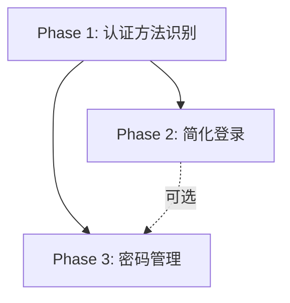

# 认证系统 UX 重构提案

# Auth System UX Redesign Proposal

**日期 Date**: 2025-11-30
**状态 Status**: 📝 草案待审批 Draft for Review
**优先级 Priority**: 🔴 P0 - 影响用户体验核心功能 Core UX Impact
**分组 Group**: G2

---

## 执行摘要 Executive Summary

### 问题陈述 Problem Statement

用户反馈当前认证系统存在严重的 UX 问题：

> "那它云端没有密码它点修改密码咋办 还有谷歌登陆的 没法也没必要改密码吧 模块逻辑是不是不对 还有你的登陆注册 密码等等 也不够大厂风格 太繁琐 不清爽 不主流 不高级"

**核心问题 Core Issues**:

1. ❌ **无密码用户困境**: OAuth/Magic Link 用户无法使用密码重置功能，但系统没有告知
2. ❌ **功能错配**: Google 登录用户无需密码，但可能看到密码相关选项
3. ❌ **不符合主流**: 未遵循 GitHub/Vercel/Linear 等大厂的认证 UX 模式
4. ❌ **流程繁琐**: 登录/注册流程复杂，不够清爽简洁

### 当前架构分析 Current Architecture Analysis

**认证方式 Auth Methods**:

- ✅ **Google OAuth** - 通过 `signInWithProvider("google")`
- ✅ **Magic Link (无密码)** - 通过 `signInWithEmail()` → `signInWithOtp()`
- ❌ **传统密码登录** - **完全不支持！**

**关键发现 Key Findings**:

#### 1. 当前系统没有密码登录！

查看 `app/(auth)/login/page.tsx`:

- Line 159-169: Google OAuth 按钮
- Line 177-203: 邮箱输入 → Magic Link 发送
- **没有密码输入框**

查看 `hooks/useSupabaseAuth.ts`:

- Line 121-147: `signInWithEmail()` → 调用 `signInWithOtp()`（Magic Link）
- Line 149-170: `signInWithProvider()` → OAuth 登录
- **没有 `signInWithPassword()` 函数**

#### 2. 账号页面缺少认证方法识别

查看 `app/account/page.tsx`:

- Line 215-245: "Security" 区块仅显示通用文本
- **没有显示用户的登录方式**（OAuth vs Magic Link）
- **没有区分功能可用性**（如密码修改仅对有密码用户可用）

#### 3. 用户遇到的实际问题

**场景**: `xiuluart@foxmail.com` 通过 OAuth/Magic Link 注册

- Supabase `auth.users` 表中 `encrypted_password` = NULL
- 用户尝试"修改密码" → 系统提示"密码错误" → 用户困惑

**根本原因**: 系统没有告知用户其账号是 OAuth 类型，无需密码

---

## 业界最佳实践 Industry Best Practices

### 参考案例 Reference Cases

#### GitHub

- **登录页**: 仅显示邮箱/密码输入框，OAuth 按钮放在底部
- **账号安全页**: 明确显示 "Signed in with Google" 徽章
- **密码管理**: OAuth 用户看到 "You're signed in via GitHub.com, password is not required"

#### Vercel

- **登录页**: 默认 Magic Link（无密码），OAuth 按钮并列
- **账号页**: "Connected Accounts" 区块显示所有 OAuth 提供商
- **密码设置**: 仅在用户选择"设置密码"后显示

#### Linear

- **登录页**: 单一邮箱输入框 → 自动检测账号类型 → 引导正确流程
- **账号页**: "Authentication" 区块列出所有登录方式，可添加/移除

### 设计原则 Design Principles

1. **渐进披露 Progressive Disclosure**: 仅显示当前用户需要的选项
2. **状态透明 State Transparency**: 清晰展示用户的认证方式
3. **智能引导 Smart Guidance**: 根据账号类型自动调整 UI
4. **零歧义 Zero Ambiguity**: 操作前明确告知可行性

---

## 重构方案 Redesign Proposal

### Phase 1: 认证方法识别与展示 (P0)

#### 1.1 增强 `useSupabaseAuth` Hook

**目标**: 识别用户的认证方法

```typescript
// hooks/useSupabaseAuth.ts 新增功能

type AuthMethod = "password" | "oauth" | "magic_link" | "unknown";

interface AuthProviderInfo {
  provider: string; // "google", "github", etc.
  connected_at: string;
}

export function useSupabaseAuth() {
  const [authMethod, setAuthMethod] = useState<AuthMethod>("unknown");
  const [oauthProviders, setOauthProviders] = useState<AuthProviderInfo[]>([]);

  // 新增: 获取用户认证方法
  const getAuthMethod = useCallback(async (): Promise<AuthMethod> => {
    if (!user) return "unknown";

    try {
      // 检查是否有 OAuth 身份
      const { data: identities } = await supabase.auth.getUserIdentities();

      if (identities && identities.length > 0) {
        setOauthProviders(
          identities.map((id) => ({
            provider: id.provider,
            connected_at: id.created_at,
          }))
        );

        // 检查是否有密码（通过 RPC 函数）
        const { data: hasPassword } = await supabase.rpc("fn_user_has_password");

        return hasPassword ? "password" : "oauth";
      }

      // 检查是否有密码（仅 Magic Link 用户）
      const { data: hasPassword } = await supabase.rpc("fn_user_has_password");
      return hasPassword ? "password" : "magic_link";
    } catch (err) {
      console.error("Failed to detect auth method:", err);
      return "unknown";
    }
  }, [user, supabase]);

  useEffect(() => {
    if (user) {
      getAuthMethod().then(setAuthMethod);
    }
  }, [user, getAuthMethod]);

  return {
    // 现有字段...
    authMethod,
    oauthProviders,
    getAuthMethod,
  };
}
```

**数据库支持**: 创建 RPC 函数

```sql
-- supabase/migrations/20251130_add_auth_helpers.sql

CREATE OR REPLACE FUNCTION fn_user_has_password()
RETURNS BOOLEAN
LANGUAGE plpgsql
SECURITY DEFINER
AS $$
BEGIN
  RETURN EXISTS (
    SELECT 1
    FROM auth.users
    WHERE id = auth.uid()
      AND encrypted_password IS NOT NULL
  );
END;
$$;
```

#### 1.2 改造账号页 - 认证方法展示

**文件**: `app/account/page.tsx`

**新增区块**: "Authentication Methods"

```typescript
// 在 Security 区块之前插入

<div className="rounded-2xl border border-[var(--stroke-soft)] bg-[var(--bg-base)]/70 p-4 space-y-3">
  <p className="text-sm text-subtle">{t("account.page.authMethodsLabel")}</p>

  {/* OAuth Provider 徽章 */}
  {authMethod === "oauth" && oauthProviders.length > 0 && (
    <div className="space-y-2">
      {oauthProviders.map(provider => (
        <div key={provider.provider} className="flex items-center gap-3 rounded-xl border border-emerald-400/30 bg-emerald-400/10 px-3 py-2">
          <Image
            src={`/providers/${provider.provider}.svg`}
            alt={provider.provider}
            width={20}
            height={20}
          />
          <div className="flex-1">
            <p className="text-sm font-medium text-emerald-100">
              {t(`account.page.provider.${provider.provider}`)}
            </p>
            <p className="text-xs text-emerald-200/70">
              {t("account.page.provider.connected")}
            </p>
          </div>
          <span className="text-xs text-emerald-300 font-semibold">
            {t("account.page.provider.active")}
          </span>
        </div>
      ))}

      {/* 密码状态说明 */}
      <div className="rounded-xl border border-slate-700 bg-slate-800/50 px-3 py-2">
        <p className="text-sm text-slate-300">
          {t("account.page.oauth.passwordNotRequired")}
        </p>
        <p className="text-xs text-slate-400 mt-1">
          {t("account.page.oauth.passwordHint")}
        </p>
      </div>
    </div>
  )}

  {/* Magic Link 用户 */}
  {authMethod === "magic_link" && (
    <div className="rounded-xl border border-amber-500/30 bg-amber-500/10 px-3 py-2">
      <p className="text-sm font-medium text-amber-100">
        {t("account.page.magicLink.title")}
      </p>
      <p className="text-xs text-amber-200/70 mt-1">
        {t("account.page.magicLink.description")}
      </p>
      <button
        type="button"
        onClick={() => router.push("/account/set-password")}
        className="mt-2 text-xs text-amber-300 underline hover:text-amber-200"
      >
        {t("account.page.magicLink.setPassword")}
      </button>
    </div>
  )}

  {/* 密码用户 */}
  {authMethod === "password" && (
    <div className="rounded-xl border border-slate-700 bg-slate-800/50 px-3 py-2">
      <p className="text-sm font-medium text-slate-200">
        {t("account.page.password.title")}
      </p>
      <p className="text-xs text-slate-400 mt-1">
        {t("account.page.password.lastChanged")}: {t("account.page.password.unknown")}
      </p>
      <button
        type="button"
        onClick={() => router.push("/account/change-password")}
        className="mt-2 text-xs text-emerald-300 underline hover:text-emerald-200"
      >
        {t("account.page.password.change")}
      </button>
    </div>
  )}
</div>
```

**国际化文本** (`lib/i18n-config.ts`):

```typescript
// 中文
"account.page.authMethodsLabel": "登录方式",
"account.page.provider.google": "Google 账号",
"account.page.provider.connected": "已连接",
"account.page.provider.active": "当前",
"account.page.oauth.passwordNotRequired": "您通过 Google 登录，无需设置密码",
"account.page.oauth.passwordHint": "如需使用密码登录，请添加密码作为备用登录方式",
"account.page.magicLink.title": "邮箱魔法链接",
"account.page.magicLink.description": "您当前使用邮箱魔法链接登录（无需密码）",
"account.page.magicLink.setPassword": "设置密码作为备用登录方式 →",
"account.page.password.title": "密码登录",
"account.page.password.lastChanged": "上次修改",
"account.page.password.unknown": "未知",
"account.page.password.change": "修改密码 →",

// English
"account.page.authMethodsLabel": "Authentication Methods",
"account.page.provider.google": "Google Account",
"account.page.provider.connected": "Connected",
"account.page.provider.active": "Active",
"account.page.oauth.passwordNotRequired": "You sign in with Google, no password required",
"account.page.oauth.passwordHint": "Add a password as backup sign-in method if needed",
"account.page.magicLink.title": "Email Magic Link",
"account.page.magicLink.description": "You currently use email magic links (no password required)",
"account.page.magicLink.setPassword": "Set password as backup sign-in method →",
"account.page.password.title": "Password Sign-In",
"account.page.password.lastChanged": "Last changed",
"account.page.password.unknown": "Unknown",
"account.page.password.change": "Change password →",
```

---

### Phase 2: 简化登录流程 (P1)

#### 2.1 当前问题分析

**登录页现状** (`app/(auth)/login/page.tsx`):

- Line 113-130: 左侧英雄区（可删除，浪费空间）
- Line 132-233: 右侧表单（过于复杂）
- Line 144-155: Banner 区（状态提示）
- Line 159-169: Google 按钮
- Line 171-175: 分隔线 "OR"
- Line 177-203: 邮箱 Magic Link 表单
- Line 204-218: Inbucket 本地提示

**问题点**:

1. 表单太大（占屏幕 50%），不够聚焦
2. 左侧英雄区重复信息（badge、title 都重复）
3. 缺少密码登录选项（如果未来需要）
4. Magic Link 流程需要跳转邮箱，不够即时

#### 2.2 重构方案 - 居中聚焦式登录页

**设计灵感**: Vercel Login Page

```typescript
// app/(auth)/login/page.tsx - 完全重写

export default function LoginPage() {
  return (
    <Suspense fallback={<LoadingFallback />}>
      <LoginContent />
    </Suspense>
  );
}

function LoginContent() {
  const { t } = useLanguage();
  const router = useRouter();
  const searchParams = useSearchParams();
  const requestError = searchParams.get("error");

  const [email, setEmail] = useState("");
  const [showMagicLinkForm, setShowMagicLinkForm] = useState(false);
  const [magicLinkStatus, setMagicLinkStatus] = useState<"idle" | "loading" | "sent">("idle");
  const [message, setMessage] = useState<{ type: "error" | "success"; text: string } | null>(null);

  const { signInWithProvider, signInWithEmail, loading, isAuthenticated } = useSupabaseAuth();

  useEffect(() => {
    if (!loading && isAuthenticated) {
      router.replace("/account");
    }
  }, [isAuthenticated, loading, router]);

  const handleGoogleLogin = async () => {
    setMessage(null);
    const result = await signInWithProvider("google");
    if (!result.success) {
      setMessage({
        type: "error",
        text: result.code === "cooldown"
          ? t("auth.error.cooldown")
          : t("auth.error.generic"),
      });
    }
  };

  const handleMagicLinkSubmit = async (event: FormEvent<HTMLFormElement>) => {
    event.preventDefault();
    setMessage(null);
    setMagicLinkStatus("loading");

    const result = await signInWithEmail(email);

    if (!result.success) {
      setMagicLinkStatus("idle");
      setMessage({
        type: "error",
        text: result.code === "invalid_email"
          ? t("auth.email.invalid")
          : result.code === "cooldown"
            ? t("auth.error.cooldown")
            : t("auth.error.generic"),
      });
      return;
    }

    setMagicLinkStatus("sent");
    setMessage({ type: "success", text: t("auth.email.sent") });
  };

  return (
    <div className="min-h-screen bg-gradient-to-b from-slate-950 via-slate-900 to-slate-950 text-slate-100 flex items-center justify-center px-4 py-10">
      {/* 居中单一卡片 */}
      <div className="w-full max-w-md space-y-6">
        {/* Logo + Title */}
        <div className="text-center space-y-3">
          <div className="inline-flex h-12 w-12 items-center justify-center rounded-xl bg-slate-800/60 font-bold tracking-[0.16em] text-emerald-200 shadow-lg">
            IA
          </div>
          <h1 className="text-2xl font-semibold">{t("auth.hero.title")}</h1>
          <p className="text-sm text-slate-400">{t("auth.hero.subtitle")}</p>
        </div>

        {/* Error/Success Banner */}
        {message && (
          <div
            className={`rounded-2xl border px-4 py-3 text-sm ${
              message.type === "error"
                ? "border-amber-500/50 bg-amber-500/10 text-amber-100"
                : "border-emerald-400/40 bg-emerald-400/10 text-emerald-100"
            }`}
            role="status"
          >
            {message.text}
          </div>
        )}

        {/* Main Card */}
        <div className="rounded-3xl border border-slate-800 bg-slate-900/80 backdrop-blur-xl shadow-[0_20px_80px_rgba(0,0,0,0.6)] p-6 space-y-4">

          {/* Google OAuth - 主要登录方式 */}
          <button
            type="button"
            onClick={handleGoogleLogin}
            disabled={loading}
            className="w-full inline-flex items-center justify-center gap-3 rounded-2xl bg-white text-slate-900 px-4 py-3 text-base font-semibold shadow-lg hover:shadow-xl transition-shadow"
          >
            <Image src="/providers/google.svg" alt="google" width={22} height={22} priority />
            <span>{t("auth.provider.google")}</span>
          </button>

          {/* Divider */}
          <div className="text-xs text-slate-500 flex items-center gap-2">
            <span className="flex-1 h-px bg-slate-800" />
            {t("auth.modal.or")}
            <span className="flex-1 h-px bg-slate-800" />
          </div>

          {/* Magic Link Toggle */}
          {!showMagicLinkForm ? (
            <button
              type="button"
              onClick={() => setShowMagicLinkForm(true)}
              className="w-full rounded-2xl border border-slate-800 bg-transparent px-4 py-3 text-sm text-slate-300 hover:text-slate-100 hover:border-slate-700 transition"
            >
              {t("auth.email.useEmail")}
            </button>
          ) : (
            <form onSubmit={handleMagicLinkSubmit} className="space-y-3">
              <input
                type="email"
                value={email}
                onChange={(e) => setEmail(e.target.value)}
                placeholder={t("auth.email.placeholder")}
                className="w-full rounded-2xl border border-slate-800 bg-transparent px-4 py-3 text-sm focus:outline-none focus:ring-2 focus:ring-emerald-400/60"
                required
                autoFocus
              />
              <div className="flex gap-2">
                <button
                  type="button"
                  onClick={() => setShowMagicLinkForm(false)}
                  className="flex-1 rounded-2xl border border-slate-800 px-4 py-2.5 text-sm text-slate-400 hover:text-slate-200 transition"
                >
                  {t("auth.email.cancel")}
                </button>
                <button
                  type="submit"
                  disabled={magicLinkStatus === "loading" || magicLinkStatus === "sent"}
                  className="flex-1 rounded-2xl bg-emerald-400 text-slate-950 px-4 py-2.5 text-sm font-semibold hover:opacity-90 transition disabled:opacity-60"
                >
                  {magicLinkStatus === "loading"
                    ? t("auth.form.loading")
                    : magicLinkStatus === "sent"
                      ? t("auth.email.sent")
                      : t("auth.email.send")}
                </button>
              </div>
            </form>
          )}
        </div>

        {/* Footer Links */}
        <p className="text-xs text-slate-500 text-center">
          {t("auth.footer.prefix")}{" "}
          <Link href="/legal/terms" className="text-emerald-300 hover:underline">
            {t("auth.footer.terms")}
          </Link>{" "}
          {t("auth.footer.connector")}{" "}
          <Link href="/legal/privacy" className="text-emerald-300 hover:underline">
            {t("auth.footer.privacy")}
          </Link>
        </p>
      </div>
    </div>
  );
}
```

**改进点总结**:

- ✅ 去除左右分栏，改为居中单卡片（聚焦）
- ✅ Google 登录突出显示（主要方式）
- ✅ Magic Link 折叠显示（减少视觉干扰）
- ✅ 减少文字冗余（保留核心信息）
- ✅ 更小的卡片尺寸（max-w-md vs max-w-5xl）

---

### Phase 3: 密码管理功能 (P2)

#### 3.1 添加密码登录支持（可选）

**目标**: 支持传统邮箱+密码登录（如果产品需求）

**新增 Hook 函数**:

```typescript
// hooks/useSupabaseAuth.ts

const signInWithPassword = useCallback(
  async (email: string, password: string): Promise<AuthResult> => {
    try {
      const { error } = await supabase.auth.signInWithPassword({
        email,
        password,
      });

      if (error) {
        return mapAuthError(error);
      }

      return { success: true };
    } catch (err) {
      console.error("密码登录失败:", err);
      return mapAuthError(err);
    }
  },
  [supabase]
);

const signUpWithPassword = useCallback(
  async (email: string, password: string): Promise<AuthResult> => {
    try {
      const { error } = await supabase.auth.signUp({
        email,
        password,
        options: {
          emailRedirectTo: `${window.location.origin}${AUTH_CALLBACK_PATH}`,
        },
      });

      if (error) {
        return mapAuthError(error);
      }

      return { success: true };
    } catch (err) {
      console.error("注册失败:", err);
      return mapAuthError(err);
    }
  },
  [supabase]
);
```

**新增登录页密码模式**:

在登录页添加 Tab 切换（Magic Link / Password）

```typescript
const [authMode, setAuthMode] = useState<"magic" | "password">("magic");
```

#### 3.2 密码修改页面

**新建文件**: `app/account/change-password/page.tsx`

```typescript
"use client";

import { useRouter } from "next/navigation";
import { useState, type FormEvent } from "react";
import { useSupabaseAuth } from "@/hooks/useSupabaseAuth";
import { useLanguage } from "@/lib/i18n";

export default function ChangePasswordPage() {
  const router = useRouter();
  const { t } = useLanguage();
  const { supabase, authMethod } = useSupabaseAuth();

  const [currentPassword, setCurrentPassword] = useState("");
  const [newPassword, setNewPassword] = useState("");
  const [confirmPassword, setConfirmPassword] = useState("");
  const [loading, setLoading] = useState(false);
  const [message, setMessage] = useState<{ type: "error" | "success"; text: string } | null>(null);

  // 阻止 OAuth 用户访问
  if (authMethod === "oauth") {
    return (
      <div className="min-h-screen bg-[var(--bg-base)] text-[var(--color-foreground)] flex items-center justify-center px-4">
        <div className="max-w-md space-y-4 rounded-2xl border border-amber-500/30 bg-amber-500/10 p-6 text-center">
          <p className="text-lg font-semibold text-amber-100">
            {t("account.password.oauthUserBlocked.title")}
          </p>
          <p className="text-sm text-amber-200/80">
            {t("account.password.oauthUserBlocked.description")}
          </p>
          <button
            onClick={() => router.push("/account")}
            className="w-full rounded-xl bg-amber-400 text-slate-950 py-2.5 font-semibold hover:brightness-105"
          >
            {t("account.page.returnToAccount")}
          </button>
        </div>
      </div>
    );
  }

  const handleSubmit = async (event: FormEvent<HTMLFormElement>) => {
    event.preventDefault();
    setMessage(null);

    if (newPassword !== confirmPassword) {
      setMessage({ type: "error", text: t("account.password.mismatch") });
      return;
    }

    if (newPassword.length < 8) {
      setMessage({ type: "error", text: t("account.password.tooShort") });
      return;
    }

    setLoading(true);

    try {
      const { error } = await supabase.auth.updateUser({
        password: newPassword,
      });

      if (error) {
        setMessage({ type: "error", text: error.message });
      } else {
        setMessage({ type: "success", text: t("account.password.changed") });
        setTimeout(() => router.push("/account"), 2000);
      }
    } catch (err) {
      setMessage({ type: "error", text: t("account.password.error") });
    } finally {
      setLoading(false);
    }
  };

  return (
    <div className="min-h-screen bg-[var(--bg-base)] text-[var(--color-foreground)] flex items-center justify-center px-4 py-10">
      <div className="w-full max-w-md space-y-6">
        <div className="text-center">
          <h1 className="text-2xl font-semibold">{t("account.password.changeTitle")}</h1>
          <p className="text-sm text-subtle mt-2">{t("account.password.changeSubtitle")}</p>
        </div>

        {message && (
          <div
            className={`rounded-2xl border px-4 py-3 text-sm ${
              message.type === "error"
                ? "border-amber-500/50 bg-amber-500/10 text-amber-100"
                : "border-emerald-400/40 bg-emerald-400/10 text-emerald-100"
            }`}
          >
            {message.text}
          </div>
        )}

        <form onSubmit={handleSubmit} className="rounded-3xl border border-[var(--stroke-soft)] bg-[var(--bg-layer)]/85 p-6 space-y-4">
          <label className="block space-y-2">
            <span className="text-sm text-subtle">{t("account.password.current")}</span>
            <input
              type="password"
              value={currentPassword}
              onChange={(e) => setCurrentPassword(e.target.value)}
              className="w-full rounded-xl border border-[var(--stroke-soft)] bg-transparent px-4 py-2.5 text-base focus:outline-none focus:ring-2 focus:ring-emerald-400/60"
              required
            />
          </label>

          <label className="block space-y-2">
            <span className="text-sm text-subtle">{t("account.password.new")}</span>
            <input
              type="password"
              value={newPassword}
              onChange={(e) => setNewPassword(e.target.value)}
              className="w-full rounded-xl border border-[var(--stroke-soft)] bg-transparent px-4 py-2.5 text-base focus:outline-none focus:ring-2 focus:ring-emerald-400/60"
              required
              minLength={8}
            />
          </label>

          <label className="block space-y-2">
            <span className="text-sm text-subtle">{t("account.password.confirm")}</span>
            <input
              type="password"
              value={confirmPassword}
              onChange={(e) => setConfirmPassword(e.target.value)}
              className="w-full rounded-xl border border-[var(--stroke-soft)] bg-transparent px-4 py-2.5 text-base focus:outline-none focus:ring-2 focus:ring-emerald-400/60"
              required
              minLength={8}
            />
          </label>

          <div className="flex gap-3 pt-2">
            <button
              type="button"
              onClick={() => router.push("/account")}
              className="flex-1 rounded-xl border border-[var(--stroke-soft)] py-2.5 text-sm text-dim hover:text-[var(--color-foreground)]"
            >
              {t("account.password.cancel")}
            </button>
            <button
              type="submit"
              disabled={loading}
              className="flex-1 rounded-xl bg-emerald-400 text-slate-950 py-2.5 text-sm font-semibold hover:brightness-105 disabled:opacity-60"
            >
              {loading ? t("account.password.changing") : t("account.password.changeButton")}
            </button>
          </div>
        </form>
      </div>
    </div>
  );
}
```

---

## 实施计划 Implementation Plan

### 时间估算 Time Estimate

| Phase       | Task                      | Estimate      | Priority |
| ----------- | ------------------------- | ------------- | -------- |
| **Phase 1** | 认证方法识别与展示        | 3-4 小时      | P0       |
| 1.1         | 增强 useSupabaseAuth Hook | 1 小时        | P0       |
| 1.2         | 创建数据库 RPC 函数       | 30 分钟       | P0       |
| 1.3         | 改造账号页 UI             | 1.5 小时      | P0       |
| 1.4         | 添加国际化文本            | 30 分钟       | P0       |
| 1.5         | 测试验证                  | 30 分钟       | P0       |
| **Phase 2** | 简化登录流程              | 2-3 小时      | P1       |
| 2.1         | 重构登录页布局            | 1.5 小时      | P1       |
| 2.2         | Magic Link 折叠交互       | 30 分钟       | P1       |
| 2.3         | 响应式适配                | 30 分钟       | P1       |
| 2.4         | 测试验证                  | 30 分钟       | P1       |
| **Phase 3** | 密码管理功能（可选）      | 3-4 小时      | P2       |
| 3.1         | 密码登录 Hook             | 1 小时        | P2       |
| 3.2         | 密码修改页面              | 2 小时        | P2       |
| 3.3         | 测试验证                  | 1 小时        | P2       |
| **总计**    |                           | **8-11 小时** |          |

### 依赖关系 Dependencies



### 风险评估 Risk Assessment

| 风险                      | 影响 | 概率 | 缓解措施                         |
| ------------------------- | ---- | ---- | -------------------------------- |
| Supabase RPC 权限问题     | 中   | 低   | 使用 SECURITY DEFINER + 测试 RLS |
| OAuth identities 接口变化 | 高   | 低   | 查阅 Supabase 官方文档确认稳定性 |
| 国际化文本遗漏            | 低   | 中   | 代码审查时检查所有 t() 调用      |
| 破坏现有登录流程          | 高   | 中   | 分支开发 + 完整回归测试          |

---

## 成功指标 Success Metrics

### 定量指标 Quantitative Metrics

- [ ] 账号页加载时正确识别认证方法（100%）
- [ ] OAuth 用户无法访问密码修改页（100% 拦截）
- [ ] 登录页表单卡片尺寸减少 40%（从 max-w-5xl → max-w-md）
- [ ] Magic Link 表单默认折叠，减少初始视觉元素数量

### 定性指标 Qualitative Metrics

- [ ] 用户不再遇到"OAuth 用户点修改密码"的困惑
- [ ] 登录页视觉更清爽，符合"大厂风格"
- [ ] 账号页明确展示认证方式，无歧义
- [ ] 代码审查通过，符合 TypeScript strict mode

---

## 附录 Appendix

### A. 当前代码问题清单

| 文件                        | 行号    | 问题                        | 优先级 |
| --------------------------- | ------- | --------------------------- | ------ |
| `app/account/page.tsx`      | 215-245 | Security 区块未区分认证方法 | P0     |
| `app/(auth)/login/page.tsx` | 110-233 | 布局过于复杂，占用空间大    | P1     |
| `hooks/useSupabaseAuth.ts`  | 全文    | 缺少 authMethod 识别逻辑    | P0     |
| `lib/i18n-config.ts`        | 全文    | 缺少认证方法相关翻译        | P0     |

### B. 参考资料

- [Supabase Auth Identities API](https://supabase.com/docs/reference/javascript/auth-getidentitiesfromuser)
- [GitHub Security Settings](https://github.com/settings/security)
- [Vercel Login UX](https://vercel.com/login)
- [Linear Authentication](https://linear.app/login)

### C. 测试用例

#### Test Case 1: OAuth 用户识别

```typescript
// __tests__/auth-method-detection.test.ts

describe("Auth Method Detection", () => {
  it("should detect OAuth user correctly", async () => {
    const { result } = renderHook(() => useSupabaseAuth());

    // Mock Google OAuth user
    mockSupabaseAuth.getUserIdentities.mockResolvedValue({
      data: [{ provider: "google", created_at: "2024-01-01" }],
    });
    mockSupabaseRPC.mockResolvedValue({ data: false });

    await waitFor(() => {
      expect(result.current.authMethod).toBe("oauth");
      expect(result.current.oauthProviders).toHaveLength(1);
      expect(result.current.oauthProviders[0].provider).toBe("google");
    });
  });

  it("should detect Magic Link user correctly", async () => {
    const { result } = renderHook(() => useSupabaseAuth());

    mockSupabaseAuth.getUserIdentities.mockResolvedValue({ data: [] });
    mockSupabaseRPC.mockResolvedValue({ data: false });

    await waitFor(() => {
      expect(result.current.authMethod).toBe("magic_link");
    });
  });
});
```

#### Test Case 2: OAuth 用户访问密码页拦截

```typescript
// __tests__/change-password-page.test.tsx

describe("Change Password Page", () => {
  it("should block OAuth users from accessing", async () => {
    mockUseSupabaseAuth.mockReturnValue({
      authMethod: "oauth",
      oauthProviders: [{ provider: "google", connected_at: "2024-01-01" }],
    });

    render(<ChangePasswordPage />);

    expect(screen.getByText(/OAuth 用户无需密码/i)).toBeInTheDocument();
    expect(screen.queryByLabelText(/当前密码/i)).not.toBeInTheDocument();
  });

  it("should allow password users to access", async () => {
    mockUseSupabaseAuth.mockReturnValue({
      authMethod: "password",
      oauthProviders: [],
    });

    render(<ChangePasswordPage />);

    expect(screen.getByLabelText(/当前密码/i)).toBeInTheDocument();
    expect(screen.getByLabelText(/新密码/i)).toBeInTheDocument();
  });
});
```

---

## 下一步行动 Next Actions

### 立即行动 Immediate Actions

1. **获取批准**: 将本提案提交给老板审阅
2. **创建分支**: `git checkout -b feature/auth-ux-redesign`
3. **启动 Phase 1**: 优先实现认证方法识别（解决当前用户痛点）

### 待确认 Pending Decisions

- [ ] 是否需要 Phase 3 密码登录功能？（当前系统仅支持 OAuth + Magic Link）
- [ ] 是否需要支持多 OAuth 提供商？（当前仅 Google）
- [ ] 是否需要"断开 OAuth 连接"功能？

---

**文档维护**: 本文档将在实施过程中持续更新
**反馈渠道**: 所有 UX 改进建议请通过 GitHub Issue 提交
